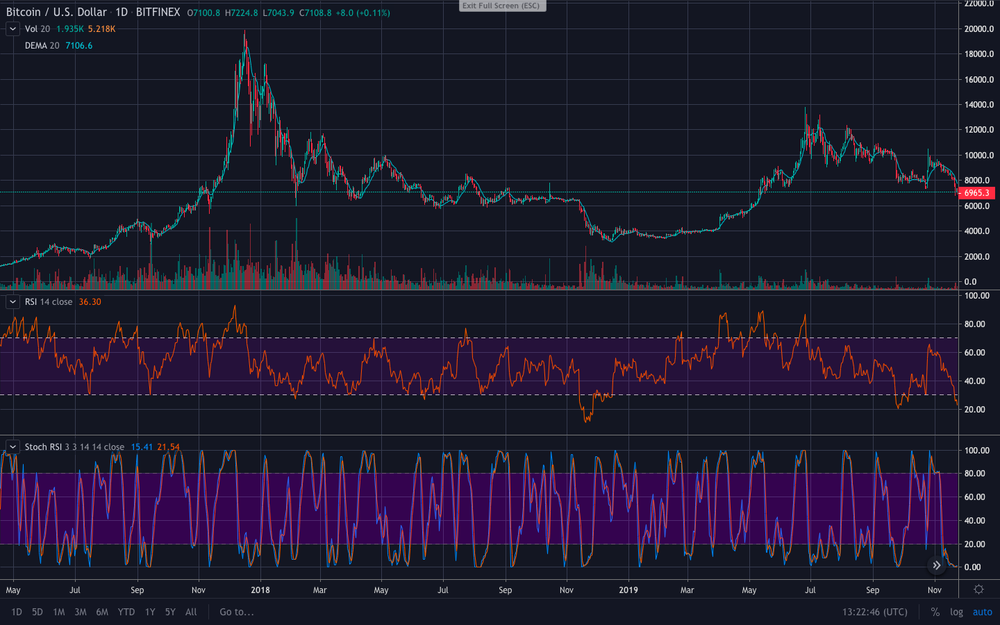

# CryptoAITrader
This contains bactesting scripts for BTC price prediction.

## Different approaches used here:
* **Retraining:** Retraining the model w.r.t. the new dataset(moving window).

* **NN2:** A second neural net that predicts the accuracy of the first neural net. It was surprising to see the effictiveness of the second NN, as it reduced bad trades by 50-60%.
 
* **Pattern training:** Identifying similar patterns accross different price ranges.
 
* **Long/Short prediction:** Instead of predicting the price this model focuses on predicting market direction(bullish/bearish).
 
## Usage
Simply `cd` into the respective folder and run `.py` scripts

## Contact
If you have any issue while running the scripts please post an issue. For any other further questions please contact Sahil at sahilnanda1995@gmail.com.